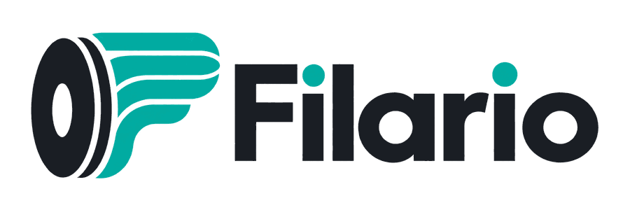

<p align="center">
  <picture>
    <source media="(prefers-color-scheme: dark)" srcset="./assets/brand/filario-logo-dark.png">
    <source media="(prefers-color-scheme: light)" srcset="./assets/brand/filario-logo-light.png">
    
  </picture>
</p>

<p align="center">
  <strong>Gestion moderne, sécurisée et auto-hébergeable de vos filaments d’impression 3D.</strong>
</p>

<p align="center">
  <a href="https://filario.fr">filario.fr</a> · 
  <a href="./docs/SELF-HOSTING.md">Auto-hébergement</a> · 
  <a href="./docs/PORTABILITY.md">Portabilité</a> · 
  <a href="./docs/SECURITY.md">Sécurité</a>
</p>

---

# Filario

Filario transforme chaque bobine en **jumeau numérique** : poids restant, matière, couleur, températures, emplacement, historique, coûts, QR code et imprimante associée.

Le projet est pensé dès le départ pour fonctionner de deux façons :

| Filario Cloud | Filario Self-Hosted |
| --- | --- |
| Utilisable depuis **filario.fr** | Installable sur votre propre serveur |
| Infrastructure gérée | Docker Compose |
| Mises à jour gérées | Mises à jour contrôlées par l’administrateur |
| Export complet des données | Import complet depuis le Cloud |
| Même cœur applicatif | Même format de données |

> **Vos données restent les vôtres.** Un utilisateur de Filario Cloud doit pouvoir migrer vers son propre serveur sans reconstruire son inventaire.

## Fonctionnalités

### Inventaire & bobines

- gestion complète des bobines ;
- poids initial et poids restant ;
- fabricant, gamme, matière et couleur ;
- températures buse / plateau / séchage ;
- prix et valeur restante ;
- lots, dates et notes ;
- historique des consommations et pesées ;
- QR code unique par bobine.

### Atelier

- emplacements et dryboxes ;
- imprimantes ;
- slots multi-filaments ;
- travaux d’impression ;
- consommation par impression ;
- fournisseurs et achats ;
- statistiques et coûts.

### Sécurité

- comptes utilisateurs ;
- rôles et organisations ;
- MFA TOTP ;
- QR MFA généré localement ;
- codes de récupération ;
- passkeys WebAuthn ;
- journal d’audit ;
- clés API avec scopes.

### Portabilité

Filario utilise un format portable **`.filario`** basé sur une archive ZIP versionnée.

Il est conçu pour transporter l’inventaire, les emplacements, les imprimantes, les historiques et les paramètres métier entre **filario.fr** et une instance auto-hébergée.

Les checksums SHA-256 permettent de vérifier l’intégrité de l’archive avant restauration. Les secrets d’authentification sensibles ne sont pas exportés en clair.

## QR & usage mobile

Chaque bobine possède un QR qui pointe vers son identifiant sécurisé. Après scan, Filario peut ouvrir directement la fiche et proposer les actions rapides : peser, consommer, déplacer, sécher, charger dans une imprimante et consulter l’historique.

## Self-Hosted

Le mode recommandé est **Docker Compose** avec PostgreSQL.

```text
┌──────────────────────────────┐
│          Filario Web         │
│      Next.js / TypeScript    │
└──────────────┬───────────────┘
               │
       ┌───────▼────────┐
       │   PostgreSQL   │
       └────────────────┘
```

À terme, l’installation se fera essentiellement avec :

```bash
cp .env.example .env
docker compose up -d
```

Voir [la documentation d’auto-hébergement](./docs/SELF-HOSTING.md).

## Mises à jour Self-Hosted

Filario prévoit une mise à jour depuis l’administration via un **paquet ZIP signé**.

Avant installation :

1. validation de la signature ;
2. validation des checksums ;
3. vérification de compatibilité ;
4. sauvegarde automatique ;
5. migrations ;
6. healthcheck ;
7. rollback lorsque possible.

Une archive arbitraire ne doit jamais être exécutée directement.

Voir [docs/UPDATES.md](./docs/UPDATES.md).

## Stack

- **TypeScript**
- **Next.js / React**
- **PostgreSQL**
- **Drizzle ORM**
- **Better Auth**
- **Docker**
- **OpenAPI**
- stockage local ou S3-compatible
- React Native / Expo prévu pour le mobile

## Design

Filario vise une interface simple, rapide, premium, lisible en mode clair et sombre, sans surcharge visuelle ni dépendance à une expérience « IA ».

Les ressources de marque sont disponibles dans `assets/brand`.

<p align="center">
  
</p>

## Documentation

| Document | Contenu |
| --- | --- |
| [Architecture](./docs/ARCHITECTURE.md) | Architecture technique et modèle Cloud / Self-Hosted |
| [Produit](./docs/PRODUCT.md) | Fonctionnalités et expérience utilisateur |
| [Portabilité](./docs/PORTABILITY.md) | Format `.filario`, export et restauration |
| [Auto-hébergement](./docs/SELF-HOSTING.md) | Installation et exploitation |
| [Mises à jour](./docs/UPDATES.md) | Mécanisme ZIP, signature et rollback |
| [Sécurité](./docs/SECURITY.md) | Authentification, API et audit |

## État du projet

> **Filario est actuellement en développement actif.**

La première version applicative Docker est en cours de validation dans la branche de développement avant intégration sur `main`.

Le choix définitif de licence open source sera défini avant la première release publique stable.

---

<p align="center">
  <strong>Filario</strong><br>
  Tout votre filament, au même endroit.
</p>
